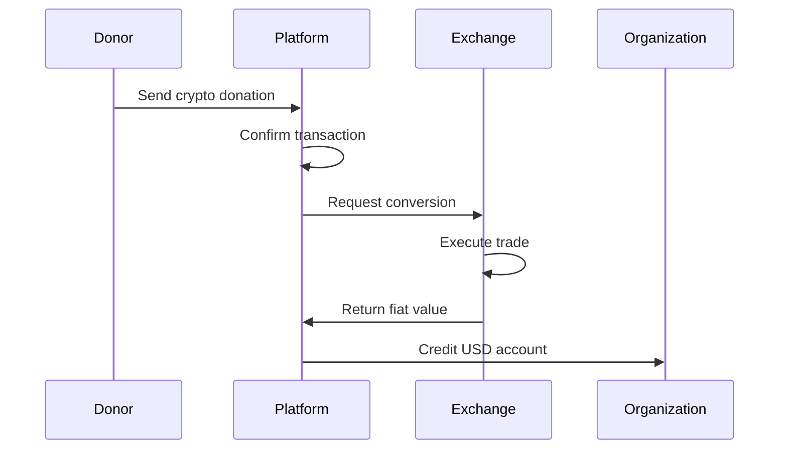

This comprehensive guide covers the technical implementation of cryptocurrency donations on the Give Protocol platform, including supported currencies, integration methods, and security considerations.

## Overview

Give Protocol provides seamless cryptocurrency donation capabilities, enabling organizations to accept digital assets with automatic conversion options and full regulatory compliance.

### Key Features

- **Multi-chain support**: Bitcoin, Ethereum, and major tokens
- **Automatic conversion**: Optional instant fiat conversion
- **Non-custodial options**: Direct wallet-to-wallet transfers
- **Tax compliance**: Automatic receipt generation
- **Real-time valuations**: Live exchange rate feeds

## Supported Cryptocurrencies

### Primary Currencies

**Bitcoin (BTC)**

- Network: Bitcoin mainnet
- Minimum donation: 0.0001 BTC
- Confirmation requirement: 3 blocks
- Average processing time: 30 minutes

**Ethereum (ETH)**

- Network: Ethereum mainnet
- Minimum donation: 0.001 ETH
- Confirmation requirement: 12 blocks
- Average processing time: 3 minutes

**USD Coin (USDC)**

- Network: Ethereum, Polygon, Solana
- Minimum donation: 1 USDC
- Stable value pegged to USD
- Lower transaction fees on L2

### Additional Supported Tokens

**Stablecoins:**

- Tether (USDT) - Ethereum, Tron, BSC
- DAI - Ethereum mainnet
- BUSD - Binance Smart Chain

**Major Cryptocurrencies:**

- Litecoin (LTC)
- Bitcoin Cash (BCH)
- Polygon (MATIC)
- Binance Coin (BNB)

## Technical Architecture

### Wallet Infrastructure

```javascript
// Wallet generation example
const { generateWallet } = require('@give-protocol/crypto');

const wallet = await generateWallet({
  currency: 'BTC',
  type: 'hierarchical-deterministic',
  derivationPath: "m/44'/0'/0'/0/0"
});

// Returns
{
  address: '1A1zP1eP5QGefi2DMPTfTL5SLmv7DivfNa',
  publicKey: '04678afdb0fe5548...',
  derivationPath: "m/44'/0'/0'/0/0",
  qrCode: 'data:image/png;base64,...'
}
```

### Address Management

**HD Wallet Structure:**

```
Master Seed
├── Organization Wallets (m/44'/0'/0')
│   ├── Org 1 (m/44'/0'/0'/0)
│   │   ├── Donation Address 1 (m/44'/0'/0'/0/0)
│   │   ├── Donation Address 2 (m/44'/0'/0'/0/1)
│   │   └── ...
│   └── Org 2 (m/44'/0'/0'/1)
└── Platform Wallets (m/44'/0'/1')
```

### Transaction Monitoring

**Blockchain Monitoring Service:**

```javascript
// WebSocket connection for real-time updates
const ws = new WebSocket('wss://api.give.io/crypto/monitor');

ws.on('message', (data) => {
  const transaction = JSON.parse(data);
  if (transaction.confirmations >= requiredConfirmations[transaction.currency]) {
    processDonation(transaction);
  }
});

// Transaction structure
{
  "txId": "0x123abc...",
  "currency": "ETH",
  "amount": "0.5",
  "from": "0xabc123...",
  "to": "0xdef456...",
  "confirmations": 12,
  "timestamp": "2024-01-15T10:30:00Z",
  "status": "confirmed"
}
```

## Integration Methods

### API Integration

**Generate Donation Address:**

```http
POST /api/v1/crypto/addresses
Authorization: Bearer your_api_key
Content-Type: application/json

{
  "organization_id": "org_123",
  "currency": "BTC",
  "amount": 0.01,
  "expires_in": 3600,
  "callback_url": "https://your-site.com/webhook"
}
```

**Response:**

```json
{
  "address": "bc1qxy2kgdygjrsqtzq2n0yrf2493p83kkfjhx0wlh",
  "currency": "BTC",
  "amount": 0.01,
  "amount_usd": 435.5,
  "expires_at": "2024-01-15T11:30:00Z",
  "qr_code": "data:image/png;base64,...",
  "payment_uri": "bitcoin:bc1qxy2kgdygjrsqtzq2n0yrf2493p83kkfjhx0wlh?amount=0.01"
}
```

### SDK Implementation

**JavaScript SDK:**

```javascript
import { CryptoGateway } from "@give-protocol/crypto-sdk";

const gateway = new CryptoGateway({
  apiKey: "your_api_key",
  environment: "production",
});

// Create donation widget
const widget = await gateway.createWidget({
  organizationId: "org_123",
  currencies: ["BTC", "ETH", "USDC"],
  fiatAmount: 100,
  onSuccess: (transaction) => {
    console.log("Donation received:", transaction);
  },
  onError: (error) => {
    console.error("Donation failed:", error);
  },
});

// Embed in page
widget.mount("#crypto-donation-container");
```

### Smart Contract Integration

**Donation Contract (Ethereum):**

```solidity
pragma solidity ^0.8.0;

contract GiveProtocolDonations {
    mapping(address => uint256) public organizationBalances;
    mapping(address => bool) public verifiedOrganizations;

    event DonationReceived(
        address indexed donor,
        address indexed organization,
        uint256 amount,
        uint256 timestamp
    );

    function donate(address organization) external payable {
        require(verifiedOrganizations[organization], "Organization not verified");
        require(msg.value > 0, "Donation must be greater than 0");

        organizationBalances[organization] += msg.value;

        emit DonationReceived(
            msg.sender,
            organization,
            msg.value,
            block.timestamp
        );
    }

    function withdraw(uint256 amount) external {
        require(verifiedOrganizations[msg.sender], "Not a verified organization");
        require(organizationBalances[msg.sender] >= amount, "Insufficient balance");

        organizationBalances[msg.sender] -= amount;
        payable(msg.sender).transfer(amount);
    }
}
```

## Conversion and Settlement

### Automatic Conversion

**Configuration Options:**

```json
{
  "conversion_settings": {
    "auto_convert": true,
    "target_currency": "USD",
    "conversion_threshold": 10,
    "conversion_frequency": "immediate",
    "slippage_tolerance": 0.02
  }
}
```

**Conversion Flow:**



### Exchange Integration

**Liquidity Providers:**

```javascript
// Exchange rate aggregation
const getExchangeRate = async (currency, amount) => {
  const providers = ["coinbase", "kraken", "binance"];

  const rates = await Promise.all(
    providers.map((provider) => fetchRate(provider, currency, amount)),
  );

  return {
    bestRate: Math.max(...rates.map((r) => r.rate)),
    provider: rates.find(
      (r) => r.rate === Math.max(...rates.map((r) => r.rate)),
    ).provider,
    timestamp: new Date().toISOString(),
  };
};
```

## Security Implementation

### Key Management

**Hardware Security Module (HSM):**

```javascript
// HSM integration for key storage
const { HSMClient } = require("@give-protocol/hsm");

const hsm = new HSMClient({
  endpoint: process.env.HSM_ENDPOINT,
  credentials: {
    keyId: process.env.HSM_KEY_ID,
    secret: process.env.HSM_SECRET,
  },
});

// Generate new wallet
const wallet = await hsm.generateKey({
  algorithm: "ECDSA",
  curve: "secp256k1",
  label: `org_${organizationId}_wallet`,
});

// Sign transaction
const signature = await hsm.sign({
  keyLabel: wallet.label,
  message: transactionHash,
});
```

### Multi-Signature Wallets

**Configuration:**

```javascript
// Multi-sig setup for high-value transactions
const multiSigWallet = {
  threshold: 2,
  signers: ["org_admin_1", "org_admin_2", "platform_escrow"],
  timelock: 86400, // 24 hours
  dailyLimit: {
    BTC: 1,
    ETH: 10,
    USD: 10000,
  },
};
```

### Transaction Validation

**Security Checks:**

```javascript
const validateTransaction = async (tx) => {
  // Check transaction format
  if (!isValidTransactionFormat(tx)) {
    throw new Error("Invalid transaction format");
  }

  // Verify signature
  const isValid = await verifySignature(tx);
  if (!isValid) {
    throw new Error("Invalid signature");
  }

  // Check for double-spend
  const isDuplicate = await checkDoubleSpend(tx);
  if (isDuplicate) {
    throw new Error("Transaction already processed");
  }

  // Validate amount limits
  if (tx.amount > limits[tx.currency]) {
    throw new Error("Amount exceeds limits");
  }

  return true;
};
```

## Compliance and Reporting

### KYC/AML Requirements

**Threshold-Based Verification:**

```javascript
const kycRequirements = {
  anonymous: {
    maxUSD: 1000,
    required: [],
  },
  basic: {
    maxUSD: 10000,
    required: ["email", "name"],
  },
  enhanced: {
    maxUSD: null,
    required: ["email", "name", "address", "id_verification"],
  },
};
```

### Transaction Reporting

**IRS Form 8283 Generation:**

```javascript
// Generate tax documentation for crypto donations
const generateForm8283 = async (donation) => {
  const fairMarketValue = await getFMV(
    donation.currency,
    donation.amount,
    donation.timestamp,
  );

  return {
    donorInfo: donation.donor,
    organizationInfo: donation.organization,
    donationDate: donation.timestamp,
    cryptocurrency: donation.currency,
    amount: donation.amount,
    fairMarketValueUSD: fairMarketValue,
    costBasis: "Not provided",
    method: "Cryptocurrency donation",
  };
};
```

### Blockchain Analytics

**Transaction Screening:**

```javascript
// Integration with blockchain analytics
const { ChainAnalysis } = require("@give-protocol/compliance");

const screenTransaction = async (tx) => {
  const risk = await ChainAnalysis.assess({
    address: tx.from,
    currency: tx.currency,
    amount: tx.amount,
  });

  if (risk.score > 0.7) {
    return {
      action: "block",
      reason: risk.factors,
    };
  } else if (risk.score > 0.4) {
    return {
      action: "review",
      reason: risk.factors,
    };
  }

  return { action: "approve" };
};
```

## User Interface Components

### Donation Widget

```html
<!-- Embeddable donation widget -->
<div
  id="give-crypto-widget"
  data-organization="org_123"
  data-currencies="BTC,ETH,USDC"
  data-theme="light"
></div>

<script src="https://cdn.give.io/crypto-widget.js"></script>
<script>
  GiveCrypto.init({
    organizationId: "org_123",
    currencies: ["BTC", "ETH", "USDC"],
    defaultAmount: 100,
    onComplete: (donation) => {
      console.log("Donation complete:", donation);
    },
  });
</script>
```

### QR Code Generation

```javascript
// Generate QR codes for crypto addresses
const generateQRCode = (address, amount, currency) => {
  const uri = buildPaymentURI(address, amount, currency);

  return QRCode.toDataURL(uri, {
    errorCorrectionLevel: "H",
    type: "image/png",
    width: 256,
    margin: 2,
  });
};

// Payment URI formats
const buildPaymentURI = (address, amount, currency) => {
  const formats = {
    BTC: `bitcoin:${address}?amount=${amount}`,
    ETH: `ethereum:${address}?value=${amount * 1e18}`,
    USDC: `ethereum:${USDC_CONTRACT}/transfer?address=${address}&uint256=${amount * 1e6}`,
  };

  return formats[currency];
};
```

## Testing and Development

### Testnet Configuration

```javascript
// Testnet endpoints
const networks = {
  development: {
    BTC: "testnet",
    ETH: "goerli",
    endpoints: {
      BTC: "https://testnet.blockchain.info",
      ETH: "https://goerli.infura.io/v3/YOUR_KEY",
    },
  },
  production: {
    BTC: "mainnet",
    ETH: "mainnet",
    endpoints: {
      BTC: "https://blockchain.info",
      ETH: "https://mainnet.infura.io/v3/YOUR_KEY",
    },
  },
};
```

### Testing Tools

**Mock Transactions:**

```javascript
// Generate test transactions
const createTestTransaction = async (params) => {
  const faucet = getFaucet(params.currency);
  const testAddress = await generateTestAddress();

  return {
    txId: generateMockTxId(),
    from: faucet.address,
    to: testAddress,
    amount: params.amount,
    currency: params.currency,
    status: "pending",
    confirmations: 0,
  };
};
```

## Performance Optimization

### Caching Strategy

```javascript
// Redis caching for exchange rates
const getCachedRate = async (currency) => {
  const cached = await redis.get(`rate:${currency}`);

  if (cached && Date.now() - cached.timestamp < 60000) {
    return cached.rate;
  }

  const rate = await fetchLiveRate(currency);
  await redis.setex(
    `rate:${currency}`,
    60,
    JSON.stringify({ rate, timestamp: Date.now() }),
  );

  return rate;
};
```

### Batch Processing

```javascript
// Batch transaction processing
const processBatch = async (transactions) => {
  const grouped = groupBy(transactions, "currency");

  for (const [currency, txs] of Object.entries(grouped)) {
    const provider = getProvider(currency);
    const results = await provider.batchProcess(txs);

    await Promise.all(
      results.map((result) =>
        updateTransactionStatus(result.txId, result.status),
      ),
    );
  }
};
```

## Support and Resources

### Developer Resources

- API Reference: `developers.give.io/crypto`
- GitHub Examples: `github.com/give-protocol/crypto-examples`
- Testnet Faucets: `faucet.give.io`
- Discord Community: `discord.gg/giveprotocol`

### Technical Support

- Email: `crypto-support@give.io`
- Developer Forum: `forum.give.io/crypto`
- Office Hours: Thursdays 2-4 PM EST

### Additional Documentation

- Security Best Practices
- Regulatory Compliance Guide
- Integration Checklist
- Performance Benchmarks
