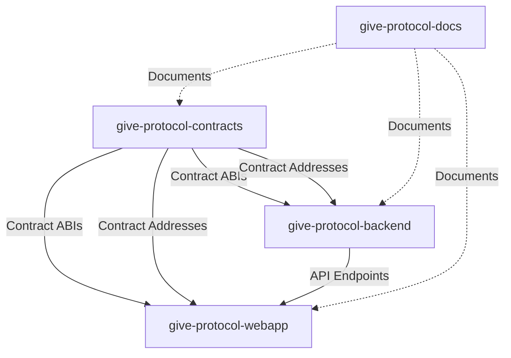

# Give Protocol Repository Migration Guide

This guide will help you migrate from your current monorepo structure to the recommended multi-repository architecture.

## Overview

**From**: Monorepo (Duration + Duration-Backend-Private + Duration-Infrastructure-Private)
**To**: 4 focused repositories

```
give-protocol-contracts  → Smart contracts, deployment, tests
give-protocol-webapp     → React PWA frontend
give-protocol-backend    → API, GraphQL, indexing
give-protocol-docs       → Documentation site
```

## Quick Start

### Option 1: Automated Migration (Recommended)

```bash
cd /home/drigo/projects/Duration/migration-scripts

# Make scripts executable
chmod +x *.sh

# Run migration
./migrate-repos.sh
```

This will create 4 new repositories in `/home/drigo/projects/` without modifying your existing repositories.

### Option 2: Manual Migration

Run each script individually:

```bash
./migrate-contracts.sh
./migrate-webapp.sh
./migrate-backend.sh
./migrate-docs.sh
```

## Post-Migration Steps

### 1. Verify Each Repository

```bash
# Check contracts repo
cd /home/drigo/projects/give-protocol-contracts
ls -la
npm install
npm run compile
npm run test

# Check webapp repo
cd /home/drigo/projects/give-protocol-webapp
ls -la
npm install
npm run lint
npm run test

# Check backend repo
cd /home/drigo/projects/give-protocol-backend
ls -la
npm install
npm run test

# Check docs repo
cd /home/drigo/projects/give-protocol-docs
ls -la
bundle install
bundle exec jekyll serve
```

### 2. Create GitHub Repositories

For each repository:

```bash
# Example for contracts
cd give-protocol-contracts

# Create repo on GitHub first, then:
git remote add origin git@github.com:your-org/give-protocol-contracts.git
git add .
git commit -m "Initial commit: Smart contracts migration"
git branch -M main
git push -u origin main
```

Repeat for:

- `give-protocol-webapp`
- `give-protocol-backend`
- `give-protocol-docs`

### 3. Set Up Environment Variables

Each repository needs its own `.env` file:

#### give-protocol-contracts

```bash
cd give-protocol-contracts
cp .env.example .env
# Edit .env with your values
```

Required variables:

- `MOONBASE_RPC_URL`
- `PRIVATE_KEY` (for deployment)
- `MOONSCAN_API_KEY`

#### give-protocol-webapp

```bash
cd give-protocol-webapp
cp .env.example .env
# Edit .env with your values
```

Required variables:

- `VITE_SUPABASE_URL`
- `VITE_SUPABASE_ANON_KEY`
- `VITE_MOONBASE_RPC_URL`
- Contract addresses (after deployment)

#### give-protocol-backend

```bash
cd give-protocol-backend
cp .env.example .env
# Edit .env with your values
```

Required variables:

- `DATABASE_URL`
- `SUPABASE_SERVICE_KEY`
- `MAILCHIMP_API_KEY`
- Contract addresses

### 4. Update Cross-Repository References

#### In webapp, update contract addresses:

After deploying contracts, update webapp `.env`:

```env
VITE_DONATION_CONTRACT_ADDRESS=0x...
VITE_VERIFICATION_CONTRACT_ADDRESS=0x...
VITE_DISTRIBUTION_CONTRACT_ADDRESS=0x...
```

#### In backend, update contract addresses:

Update backend `.env`:

```env
DONATION_CONTRACT_ADDRESS=0x...
VERIFICATION_CONTRACT_ADDRESS=0x...
DISTRIBUTION_CONTRACT_ADDRESS=0x...
```

### 5. Set Up CI/CD

#### GitHub Actions for Contracts

Create `.github/workflows/test.yml`:

```yaml
name: Test Smart Contracts

on: [push, pull_request]

jobs:
  test:
    runs-on: ubuntu-latest
    steps:
      - uses: actions/checkout@v3
      - uses: actions/setup-node@v3
        with:
          node-version: "18"
      - run: npm install
      - run: npm run compile
      - run: npm run test
      - run: npm run lint:sol
```

#### GitHub Actions for Webapp

Create `.github/workflows/test.yml`:

```yaml
name: Test & Build

on: [push, pull_request]

jobs:
  test:
    runs-on: ubuntu-latest
    steps:
      - uses: actions/checkout@v3
      - uses: actions/setup-node@v3
        with:
          node-version: "18"
      - run: npm install
      - run: npm run lint
      - run: npm run test
      - run: npm run build
```

#### Vercel Deployment for Webapp

1. Import `give-protocol-webapp` to Vercel
2. Set environment variables in Vercel dashboard
3. Deploy

### 6. Update Documentation

#### In give-protocol-docs:

1. Update repository URLs in documentation
2. Add links to other repositories
3. Update deployment instructions
4. Add cross-repository development guide

### 7. Create Monorepo Manager (Optional)

If you want to work with all repos together, create a parent directory:

```bash
cd /home/drigo/projects
mkdir give-protocol
cd give-protocol

# Clone all repos
git clone git@github.com:your-org/give-protocol-contracts.git
git clone git@github.com:your-org/give-protocol-webapp.git
git clone git@github.com:your-org/give-protocol-backend.git
git clone git@github.com:your-org/give-protocol-docs.git

# Optional: Use Turborepo or Nx for monorepo management
```

Create `package.json` in parent directory:

```json
{
  "name": "give-protocol",
  "private": true,
  "workspaces": [
    "give-protocol-contracts",
    "give-protocol-webapp",
    "give-protocol-backend",
    "give-protocol-docs"
  ],
  "scripts": {
    "dev": "npm-run-all --parallel dev:*",
    "dev:contracts": "cd give-protocol-contracts && npm run node",
    "dev:webapp": "cd give-protocol-webapp && npm run dev",
    "dev:backend": "cd give-protocol-backend && npm run dev",
    "dev:docs": "cd give-protocol-docs && npm run serve",
    "test": "npm-run-all test:*",
    "test:contracts": "cd give-protocol-contracts && npm run test",
    "test:webapp": "cd give-protocol-webapp && npm run test",
    "test:backend": "cd give-protocol-backend && npm run test"
  },
  "devDependencies": {
    "npm-run-all": "^4.1.5"
  }
}
```

## Repository Dependencies



## Development Workflow

### Full Stack Development

1. **Terminal 1 - Contracts** (optional, for local testing):

   ```bash
   cd give-protocol-contracts
   npm run node  # Local Hardhat node
   ```

2. **Terminal 2 - Backend**:

   ```bash
   cd give-protocol-backend
   npm run dev
   ```

3. **Terminal 3 - Frontend**:

   ```bash
   cd give-protocol-webapp
   npm run dev
   ```

4. **Terminal 4 - Docs** (optional):
   ```bash
   cd give-protocol-docs
   npm run serve
   ```

### Contract Development

```bash
cd give-protocol-contracts
npm run compile
npm run test
npm run deploy:moonbase
```

### Frontend Development

```bash
cd give-protocol-webapp
npm run dev
# Update contract addresses in .env after deployment
```

### Backend Development

```bash
cd give-protocol-backend
npm run dev
# Update contract addresses in .env after deployment
```

## Troubleshooting

### Issue: Missing dependencies

**Solution**: Run `npm install` in each repository

### Issue: Contract addresses not found

**Solution**: Deploy contracts first, then update `.env` files in webapp and backend

### Issue: Supabase connection errors

**Solution**: Verify `SUPABASE_URL` and `SUPABASE_ANON_KEY` in `.env`

### Issue: Port conflicts

**Solution**: Update ports in each project:

- Webapp: `vite.config.ts` (default 5173)
- Backend: `.env` PORT variable (default 3001)
- Docs: `_config.yml` (default 4000)

## Cleanup

After verifying migration success:

```bash
# Backup original repositories
cd /home/drigo/projects
mkdir _backup_$(date +%Y%m%d)
mv Duration _backup_$(date +%Y%m%d)/
mv Duration-Backend-Private _backup_$(date +%Y%m%d)/
mv Duration-Infrastructure-Private _backup_$(date +%Y%m%d)/

# Or delete if you're confident
# rm -rf Duration
# rm -rf Duration-Backend-Private
# rm -rf Duration-Infrastructure-Private
```

## Benefits of New Structure

1. **Clearer Separation of Concerns**
   - Each repo has a single responsibility
   - Easier to understand and navigate

2. **Independent Versioning**
   - Version contracts separately from frontend
   - Clearer changelog per component

3. **Granular Access Control**
   - Give different team members access to specific repos
   - Contractors can work on docs without accessing contracts

4. **Better CI/CD**
   - Faster builds (only build what changed)
   - Separate deployment pipelines
   - Independent release cycles

5. **Easier Onboarding**
   - New developers can start with just frontend
   - Documentation separate from code

6. **Scalability**
   - Add microservices easily
   - Split frontend into multiple apps if needed

## Additional Resources

- [GitHub Repository Structure Best Practices](https://docs.github.com/en/repositories)
- [Turborepo Documentation](https://turbo.build/repo/docs)
- [Nx Monorepo Documentation](https://nx.dev)

## Support

If you encounter issues during migration:

1. Check this guide's troubleshooting section
2. Review individual repository READMEs
3. Check migration scripts for errors
4. Restore from backup if needed

## Next Steps

1. ✅ Run migration scripts
2. ✅ Verify each repository
3. ✅ Create GitHub repositories
4. ✅ Set up environment variables
5. ✅ Configure CI/CD
6. ✅ Deploy contracts
7. ✅ Update contract addresses
8. ✅ Deploy webapp and backend
9. ✅ Deploy documentation
10. ✅ Clean up old repositories

Good luck with your migration! 🚀
